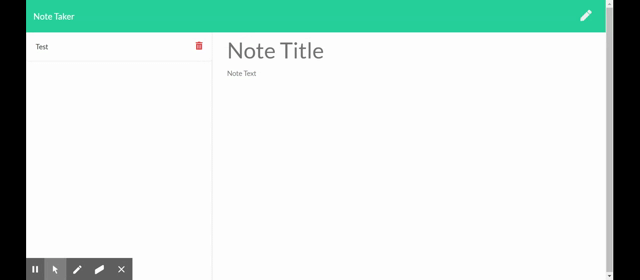

# 11-Note-Taker

## Description
This note taking application allows the user to create, save, and delete notes. The notes are saved on a json file. This application is deployed on heroku. The application was made possible with the use of node.js and express. The html and js files are loaded through the help of server requests.

## Challenges 
Getting the front-end to communicate with the back-end, using api-routes and html-routes. The json file is read and it's contents are used when needed. The files content is altered so making sure the object structure remained intact was a challenge. Making sure all of the files connected to the app was a hurdle.

## Usage instructions

The app is deployed in heroku at the link below.

https://note-taker-rsm.herokuapp.com/

Here is a gif that displays how the application works.

## License

MIT 

Copyright 2020 Raunel Suarez-Magana

Permission is hereby granted, free of charge, to any person obtaining a copy of this software and associated documentation files (the "Software"), to deal in the Software without restriction, including without limitation the rights to use, copy, modify, merge, publish, distribute, sublicense, and/or sell copies of the Software, and to permit persons to whom the Software is furnished to do so, subject to the following conditions:

The above copyright notice and this permission notice shall be included in all copies or substantial portions of the Software.

THE SOFTWARE IS PROVIDED "AS IS", WITHOUT WARRANTY OF ANY KIND, EXPRESS OR IMPLIED, INCLUDING BUT NOT LIMITED TO THE WARRANTIES OF MERCHANTABILITY, FITNESS FOR A PARTICULAR PURPOSE AND NONINFRINGEMENT. IN NO EVENT SHALL THE AUTHORS OR COPYRIGHT HOLDERS BE LIABLE FOR ANY CLAIM, DAMAGES OR OTHER LIABILITY, WHETHER IN AN ACTION OF CONTRACT, TORT OR OTHERWISE, ARISING FROM, OUT OF OR IN CONNECTION WITH THE SOFTWARE OR THE USE OR OTHER DEALINGS IN THE SOFTWARE.